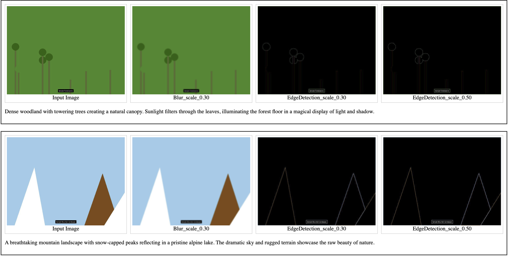

# Image Gallery Generation Pipeline


This repository provides a two-step workflow to turn your raw images and method outputs into a neat, web-ready HTML gallery.

## Pre-processing (`pre_process.py`)

* Resizes oversize input images (max dimension configurable).
* Flattens and normalizes your nested `method_results/` into a standard folder structure.
* Renames all result files to `<basename>_result.<ext>` and resizes them to match their inputs.

## HTML Generation (`html_gallery.py`)

* Scans the processed folders plus your caption files (`<basename>_caption.txt`).
* Builds a CSS-grid gallery with a configurable number of columns.
* Outputs a single `gallery.html` you can open in any browser.

## 📋 Requirements

* Python 3.7+
* Pillow for image resizing
* (optional) virtual environment

```bash
python3 -m venv venv
source venv/bin/activate
pip install Pillow
```

## 🚀 Quick Start with Sample Data

```bash
# Clone the repository
git clone https://github.com/Dominoer/image-gallery-generator.git
cd image-gallery-generator

# Run with sample data
python src/pre_process.py \
  --input_folder sample_data/input \
  --method_results sample_data/method_results \
  --output_folder processed \
  --max_size 1024

python src/html_gallery.py \
  --input_folder processed/input \
  --captions_folder sample_data/captions \
  --method_results processed/method_results \
  --html_output gallery.html \
  --images_per_row 4

# Open gallery.html in your browser
```

## 🔧 Directory Layout

### Before processing (your "raw" data)

```
project_root/
├── input/                  ← raw input images
│   ├── foo.jpg
│   └── bar.png
└── method_results/         ← your outputs, possibly nested
    ├── MethodA/
    │   ├── scale_0.30/
    │   │   ├── foo_scale_0.30_result.png
    │   │   └── bar_scale_0.30_result.png
    │   └── scale_0.50/
    │       ├── foo_scale_0.50_result.png
    │       └── bar_scale_0.50_result.png
    └── MethodB/
        └── SubMethodA/
            └── scale_0.50/
                ├── foo_result.png
                └── bar_result.png
```

## 1. Pre-processing

```bash
python src/pre_process.py \
  --input_folder input \
  --method_results method_results \
  --output_folder processed \
  --max_size 1024
```

* `--input_folder`: your raw `input/`
* `--method_results`: parent folder of all method subfolders
* `--output_folder`: where we'll write the cleaned structure (`processed/`)
* `--max_size`: maximum width or height (default: 1024)

After running, you'll have:

```
processed/
├── input/
│   ├── foo.jpg          ← resized if >1024px
│   └── bar.png
└── method_results/
    ├── MethodA_scale_0.30/
    │   ├── foo_result.png
    │   └── bar_result.png
    ├── MethodA_scale_0.50/
    │   ├── foo_result.png
    │   └── bar_result.png
    └── MethodB_SubMethodA_scale_0.50/
        ├── foo_result.png
        └── bar_result.png
```

## 2. Generate the HTML Gallery

```bash
python html_gallery.py \
  --input_folder processed/input \
  --captions_folder captions \
  --method_results processed/method_results \
  --html_output gallery.html \
  --images_per_row 4
```

* `--input_folder`: processed inputs
* `--captions_folder`: contains `<basename>_caption.txt` caption files
* `--method_results`: processed/normalized method outputs
* `--html_output`: output HTML filename (default: `gallery.html`)
* `--images_per_row`: columns per row in the CSS grid (default: 4)

Open `gallery.html` in your browser to view your gallery.

## 🎨 Customization

* **CSS tweaks**: edit the `<style>` block in `html_gallery.py`.
* **Resolution**: change `--max_size` to control image dimensions.
* **Layout**: adjust `--images_per_row` for more or fewer columns.

## 📁 Sample Data

This repository includes sample data with public domain images from Unsplash:
- `sample_data/input/`: 3 sample input images
- `sample_data/method_results/`: Simulated method outputs 
- `sample_data/captions/`: Sample caption files

## 🤝 Contributing

Contributions are welcome! Please feel free to submit a Pull Request.

## 📄 License

This project is licensed under the MIT License - see the [LICENSE](LICENSE) file for details.